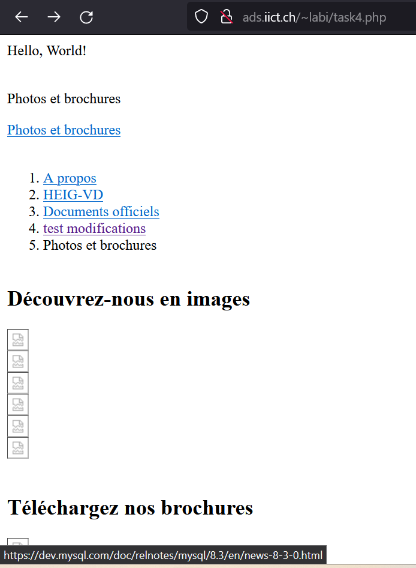

# ADS Lab 04 - Scripting
Authors: Céline Roger et Grégoire Guyot
Date: 8 avril 2024
## Task 1: Set up web directory
1. Create the directory public_html. Create a file foo.txt in it and retrieve the file using the browser on your local machine.
```
echo "Hello, I am labi!" > ~/public_html/foo.txt

```
2. Navigate to the URL http://ads.iict.ch/~albert_einstein/foo.txt. You should see the contents of the file.


## Task 2: Create thumbnails
1. Download a zip archive containing the picture and brochure files from this URL: http://ads.iict.ch/lab04_raw_files.zip Use the commands curl to download and unzip to unarchive.
By placing the files into your web directory you can inspect them using your browser.
```
curl -O http://ads.iict.ch/lab04_raw_files.zip
unzip lab04_raw_files.zip
```


### `show_dimensions` script

```
#!/bin/bash

cd lab04_raw_files || exit 1

for file in *.jpg *.png; do
    if [ -f "$file" ]; then
        dimensions=$(identify -format 'width: %w, height: %h' "$file")
        echo "File: $file"
        echo "Dimensions: $dimensions"
    fi
done

```

### `rename_pictures` script
```
#!/bin/bash

# Répertoire contenant les fichiers
files_directory="lab04_raw_files"

# Répertoire où seront stockées les images renommées
renamed_pictures_directory="/home/labi/public_html/$files_directory/dimensions/"

# Créer le répertoire si il n'existe pas encore
mkdir -p "$renamed_pictures_directory"

cd "$files_directory" || exit 1

# Boucler sur les images du répertoire
for file in *.jpg *.png; do
    if [ -f "$file" ]; then
        # Extraire les dimensions du fichier grâce à identify
        dimensions=$(identify -format '%w_%h' "$file")

        extension="${file##*.}"

        new_filename="${file%.*}_$dimensions.$extension"  # Ajoute la dimension et l'extension

        # Copie le fichier renommé dans le nouveau répertoire
        cp "$file" "${renamed_pictures_directory}${new_filename}"
    fi
done
# La solution pour ne pas accumuler les dimensions dans le nom du fichier est de placer le fichier renommé dans un dossier de sortie spécifique
```

### `thumbnails` script

```
#!/bin/bash

# Répertoire contenant les fichiers
files_directory="lab04_raw_files"

# Répertoire où seront stockés les thumbnails
base_thumbnail_directory="/home/labi/public_html/$files_directory/thumbnails"

# Sous-répertoires pour les thumbnails des images et des PDFs
image_thumbnail_directory="$base_thumbnail_directory/images"
pdf_thumbnail_directory="$base_thumbnail_directory/pdfs"

# Créer les répertoires s'ils n'existent pas encore
mkdir -p "$image_thumbnail_directory"
mkdir -p "$pdf_thumbnail_directory"

cd "$files_directory" || exit 1


# Boucler sur les fichiers dans le répertoire
for file in *.jpg *.png *.pdf; do
    # Vérifie si c'est bien un fichier
    if [ -f "$file" ]; then
      extension=${file##*.}
      filename=${file%%.*}

      full_path_source="$(pwd)/$file"

      # On vérifie si le fichier en question est un pdf
      if [ "$extension" = "pdf" ]; then
          # Pour les PDFs, utiliser le sous-répertoire pdfs
          thumbnail="${pdf_thumbnail_directory}/${filename}_thumb.jpg"
          convert -geometry 300 "${full_path_source}[0]" "$thumbnail"
          echo "Thumbnail created for $file from first page of PDF in $pdf_thumbnail_directory"
      else
          # Pour les images, utiliser le sous-répertoire images
          thumbnail="${image_thumbnail_directory}/${filename}_thumb.${extension}"
          convert -geometry 300 "$full_path_source" "$thumbnail"
          echo "Thumbnail created for $file in $image_thumbnail_directory"
      fi


    fi
done

# Étant donné que les fichiers thumbnails sont placés dans le dossier thumbnail, les fichiers thumbnailés ne pourront pas l'être une nouvelle fois
```


## Task 3: Generate HTML file
Selon l'hypothèse "The picture files are in the directory public_html/raw_files", j'ai fais la commande 
`mv lab04_raw_files raw_files` dans le dossier `public_html`.

### `make_html` script
```
#!/bin/bash

begin_path="/home/labi/public_html/lab04_template/template_begin.html"
end_path="/home/labi/public_html/lab04_template/template_end.html"
output_file="/home/labi/public_html/page.html"
img_dir="/home/labi/public_html/raw_files/thumbnails/images"
pdf_dir="/home/labi/public_html/raw_files/thumbnails/pdfs"

# Copier le début du template dans le fichier html
cat $begin_path > $output_file

echo '<article class="container article">' >> $output_file
echo '<div class="row">' >> $output_file
echo '<div class="col-md-10 col-md-pull-3 col-md-offset-4 article__content">' >> $output_file
echo '<div><div><h2>Découvrez-nous en images</h2></div></div>' >> $output_file
echo '<div class="row">' >> $output_file


# Boucler sur les images du dossier raw_files
for file in $img_dir/*.png $img_dir/*.jpg; do
    filename=$(basename "$file")
    echo '<div class="col-md-6 col-xs-12">' >> $output_file
    echo "<a href=\"files/$filename\"></a>" >> $output_file
    echo '</div>' >> $output_file
done

echo '</div></div></div>' >> $output_file
echo '<div class="row" style="margin-top: 40px;">' >> $output_file
echo '<div class="col-md-10 col-md-pull-3 col-md-offset-4 article__content">' >> $output_file
echo '<div><div><h2>Téléchargez nos brochures</h2></div></div>' >> $output_file
echo '<div class="row">' >> $output_file

# Boucler sur les fichiers PDF  du dossier raw_files
for pdf_file in $pdf_dir/*.jpg; do
    pdf_filename=$(basename "$pdf_file")
    echo '<div class="col-md-6 col-xs-12">' >> $output_file
    echo "<a href=\"files/$pdf_filename\"></a>" >> $output_file
    echo '</div>' >> $output_file
done


echo '</div></div></div></article>' >> $output_file

# Copier la fin du template dans le fichier html
cat $end_path >> $output_file

echo "HTML file generated at $output_file"
```


## Task 4: Use SSH Tunneling
```
ssh -L 5000:localhost:3306 labi@ads.iict.ch
```

Nous avons rajouté la ligne "test modifications" dans le menu.

Nous voyons ici que les modifications apparraissent bien quand nous rechargons le fichier php.